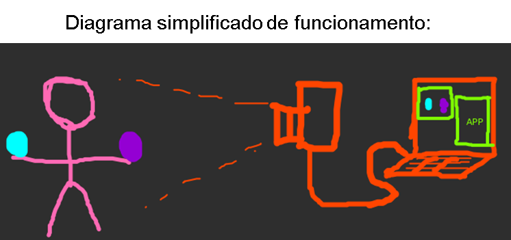
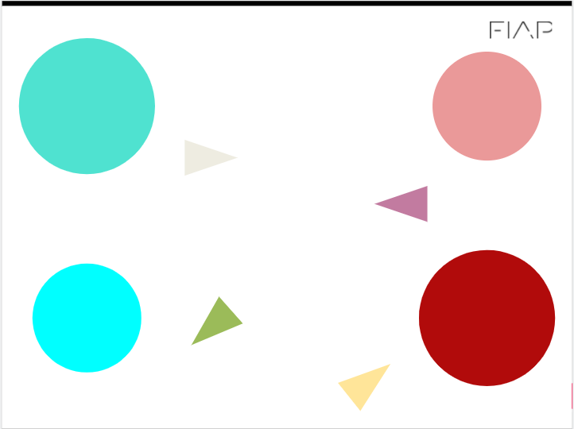

## Checkpoint    

## Python e OpenCV

Nesta checkpoint vamos desenvolver um projeto de visão computacional para a indústria de jogos, acessibilidade e outras várias possibilidades.  

O nosso programa será capaz de captar através de uma webcam “ alguns movimentos específicos” e emular ações do nosso teclado. Se conseguimos ativar comandos através de gestos (visão computacional), podemos desenvolver muitas aplicações para jogos (kinect), acessibilidade (pessoas com mobilidade reduzida) dentre outras aplicações de automação de processos.



```
!!! video
    
```

## Informações importantes Entrega

Apresentar em aula a solução funcionando de acordo com a rubrica até o ``dia 17/10``

Entrega individual ou em grupo (pode ser ou não o mesmo grupo da challenge)

## Rubrica - Critérios de entrega e avaliação para nota:

***R1 - NOTA 6: Use a imagem circulo.png para implementar um código que:***

- Segmenta apenas as 2 maiores áreas da imagem [circulo.png](circulo.PNG). Use a técnica que achar mais apropriada. E exiba o resultado. ***(máx 3 pontos)***

- Calcule e exiba a área e o centro de massa das regiões segmentadas da imagem. O resultado esperado e uma imagem com marcação no centro indicando o Centro de Massa e o valor da área; ***(máx 3 pontos)***

- Essa rubrica pode ser feita no jupyter notebook ou google Colab.

Download da imagem: [circulo.png](circulo.PNG)




*** R2 - NOTA 8: Faz o R1 e:***

- Traça uma reta entre os dois centros segmentados; (máx 0,5 pontos) 
Calcula o ângulo de inclinação da reta em relação ao plano horizontal, inclinação em graus. O resultado esperado é uma imagem com  uma reta entre centros e o valor do ângulo exibido na tela;  ***(máx 1,5 pontos)***
  
- Essa rubrica pode ser feita no jupyter notebook ou google Colab.

***R3 - NOTA 10: Faz o R2 e:***

- Realiza o processamento com imagens da`` webcam ``(executa um script .py) O resultado esperado é uma janela da OpenCV que exibe os contornos dos 2 areas maiores, a reta entre centros dos círculos e o valor do ângulo em relação ao plano horizontal; ***(máx 2 pontos)*** 

- Essa rubrica não pode ser feita no jupyter notebook ou google Colab. Deve ser um script python ``.py``. 

**Alternativas para quem não tem webcam no pc**

- Conecte com a webcam do celular 
- Use uma webcam USB
- Use um video abaixo:
    - Download da imagem: [video.png](video.PNG)
    - Download do video: [video.mp4](video.mp4)

***R4 - BÔNUS (2 pontos extras) : Faz o R3 e:***

- Essa é a parte legal do checkpoint. Controla um jogo da sua escolha, o programa irá emular o pressionamento das teclas do teclado em função do ângulo de inclinação (ex: ângulo positivo vira para direita, ângulo negativo vira para esquerda se for um jogo de corrida). 

- Essa rubrica não pode ser feita no jupyter notebook ou google Colab. Deve ser um script python ``.py``. 
- Sugestão: use como referencia o código: [emulatecla.py](emulatecla.py)
